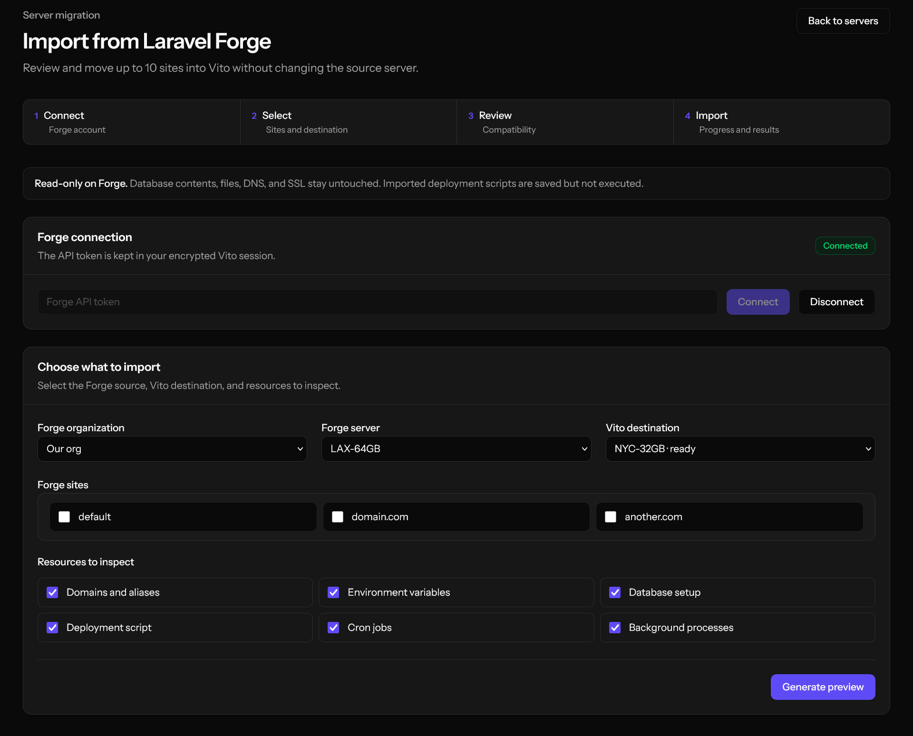
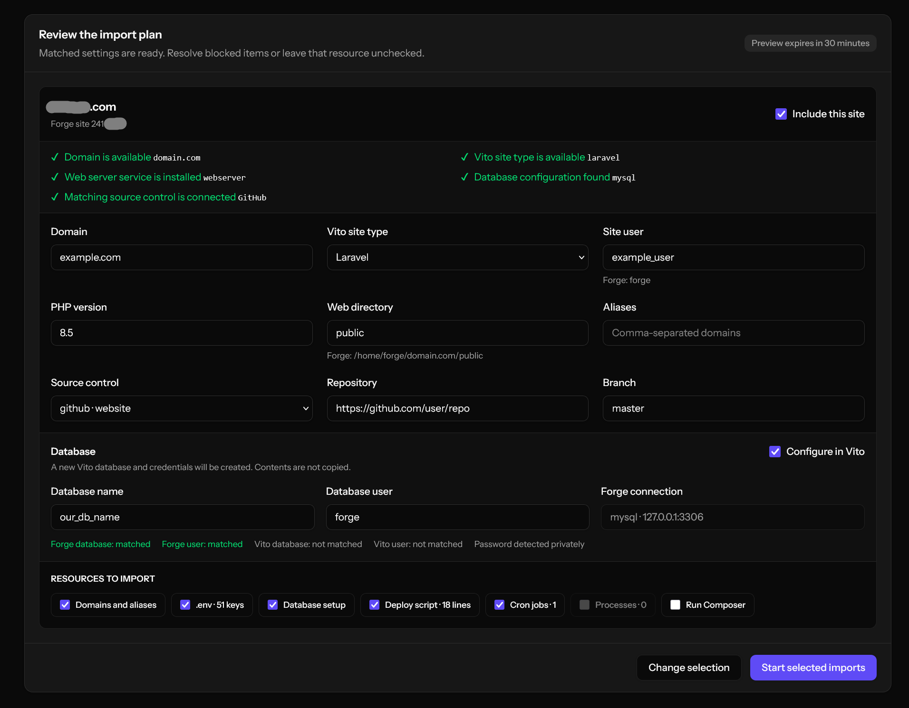

# VitoDeploy Forge Importer

[](https://github.com/cp6/VitoDeploy-Forge-Importer/releases)
[](LICENSE)

A VitoDeploy 4.x plugin for previewing and importing one or many Laravel Forge sites into an existing Vito server. Every site and resource can be reviewed, edited, enabled, or skipped before the import starts.

The plugin uses Laravel Forge's current organization-scoped API. It only reads from Forge and never changes or deletes the source sites.

## Screenshots

### Connect and select sites



### Review and customize the import plan



## Features

- Import a single site or multiple sites in one run (10 by default).
- Browse Forge organizations, servers, and sites from a Vito GUI.
- Use a responsive Tailwind CSS interface built from Vito's typography, color, spacing, and dark-mode tokens.
- Compare Forge settings with the selected Vito server and show matched or blocked checks.
- Show a green database detection check for connections such as MySQL, MariaDB, PostgreSQL, and SQLite.
- Start from Vito-native defaults for site type, isolated user, web directory, and type-specific fields while showing the original Forge values for reference.
- Edit the proposed domain, aliases, site type, Linux user, PHP version, source control, repository, branch, web directory, Node version, port, and start command.
- Independently include or skip aliases, `.env`, database setup, deployment scripts, scheduled jobs, and background processes.
- Match Forge database metadata and `DB_*` values, then create or reuse editable Vito database/user suggestions with fresh credentials.
- Translate common Forge paths and deployment variables to their Vito equivalents.
- Run imports asynchronously, display progress, retain per-resource results, and retry partial failures.
- Encrypt import snapshots and user selections using Vito's Laravel application key.

## What can be imported

| Forge setting | Vito result | Notes |
| --- | --- | --- |
| Site/application | New Vito site | Domain, type, user, runtime, repository, branch, and web directory remain editable. |
| Primary domain and aliases | Domain and aliases | DNS is not changed. |
| Environment variables | Site `.env` | Values are never exposed in the preview response. |
| Database setup | Vito database and user | Names are matched/editable; missing resources are created and `.env` credentials are rewritten. Tables and rows are not copied. |
| Deployment script | Vito deployment script | Common Forge variables and paths are translated; the script is not run by the importer. |
| Scheduled jobs | Vito cron jobs | Existing matching commands are skipped. |
| Background processes | Vito workers | Imported workers are configured for automatic start and restart. |

## Requirements

- VitoDeploy 4.x
- PHP 8.4 or newer
- A running Vito queue worker
- A ready destination server in the current Vito project
- The web server, PHP version, process-manager, and database services required by the selected resources
- A Vito source-control connection for repository-backed sites
- A Laravel Forge API token with these read-only scopes:
  - `organization:view`
  - `server:view`
  - `resources:view`

The plugin does not need a user-profile scope and does not use Forge's deprecated `/api/v1` API. See the [current Forge API documentation](https://laravel.com/forge/docs/api-reference/introduction).

## Installation

1. In Vito, open **Admin → Plugins**.
2. Choose the GitHub/quick-install option.
3. Enter `https://github.com/cp6/VitoDeploy-Forge-Importer`.
4. Install and enable **Forge Site Importer**.
5. Ensure the Vito queue worker is running.
6. Open a destination server and select **Features → Forge Importer → Open Importer**.

For local development, clone the repository into the Vito application at:

```text
app/Vito/Plugins/Cp6/VitoDeployForgeImporter
```

Then install and enable it from Vito's plugin administration screen.

### Frontend development

The release includes a compiled Tailwind stylesheet, so Vito installations do not need Node.js to run the plugin. When changing classes in `resources/views/importer.blade.php`, rebuild the committed stylesheet with:

```bash
npm install
npm run build:css
```

## Using the importer

1. Create a read-only token in Laravel Forge with the scopes listed above.
2. Open the importer and connect the token.
3. Choose a Forge organization and server.
4. Select one or more Forge sites and a Vito destination server.
5. Tick the resource types Forge should inspect and generate the preview.
6. Review the matched/blocked checks and customize every proposed value.
7. Untick any site or resource that should not be imported.
8. Start the import and follow the progress report.
9. Optionally let the importer create/reuse the matching Vito database and user and rewrite the imported `DB_*` values with fresh Vito credentials.
10. Transfer database **contents** and application files separately, test the destination, change DNS, and issue new SSL certificates in Vito.

### Database import details

With **Database metadata/setup** selected, the preview compares the site's `DB_*` environment values with Forge database schemas/users and the destination Vito server. Each site can be enabled or skipped independently, and its proposed database and username are editable.

Forge exposes database/user IDs, names, status and timestamps, but its database resource endpoints do not return passwords or data. The importer therefore creates missing Vito resources with a fresh credential (or safely reuses an existing Vito user), then rewrites `DB_CONNECTION`, `DB_HOST`, `DB_PORT`, `DB_DATABASE`, `DB_USERNAME`, and `DB_PASSWORD` in the imported environment. It does not copy tables or rows.

The Forge token remains in the encrypted Vito session while connected. Use **Disconnect** when finished.

## Configuration

Defaults are defined in [`config/forge-import.php`](config/forge-import.php):

| Option | Default | Purpose |
| --- | --- | --- |
| `base_url` | `https://forge.laravel.com/api` | Current Forge API base URL. |
| `request_timeout` | `25` | Forge request timeout in seconds. |
| `plan_ttl_minutes` | `30` | Lifetime of a generated preview before it must be regenerated. |
| `max_sites_per_run` | `10` | Maximum selected sites in one import. |
| `poll_seconds` | `20` | Delay while waiting for Vito site installation. |
| `drop_tables_on_uninstall` | `false` | Whether uninstalling removes importer history tables. |

Override these values through the host application's `forge-import` configuration when needed.

## Not migrated

- Database tables, rows, routines, triggers, or other contents
- Existing Forge database passwords (the importer generates or reuses Vito credentials)
- Uploaded files, storage directories, or other shared application files
- DNS records
- SSL certificates or private keys
- Forge deploy keys and source-control credentials
- Deployment history and logs
- Raw Nginx configuration, redirects, or security rules
- Server provisioning and system-level services

These need separate transfer or re-creation because they involve live data, credentials, certificates, or infrastructure outside a Vito site definition.

## Safety and security

- Forge requests made by this plugin are read-only.
- The API token is encrypted in the authenticated Vito session and is not stored in an import run or queue payload.
- Import snapshots and selections are encrypted at rest with Vito's application key.
- Preview responses reveal `.env` key names, but not their values.
- Import routes require Vito authentication, access to the current project, and normal site-creation authorization.
- Cancelling an import stops future work; it does not delete Vito resources already created.
- Make backups and test the imported site before changing production DNS.

## Updating

Releases and tags are used by Vito's plugin updater. Review the release notes, update through Vito, and keep the queue worker running while an import is active.

## Development and tests

The tests run inside a VitoDeploy 4.x checkout after the plugin is placed at the local-development path shown above:

```bash
php artisan test app/Vito/Plugins/Cp6/VitoDeployForgeImporter/tests
```

## License

[MIT](LICENSE)
